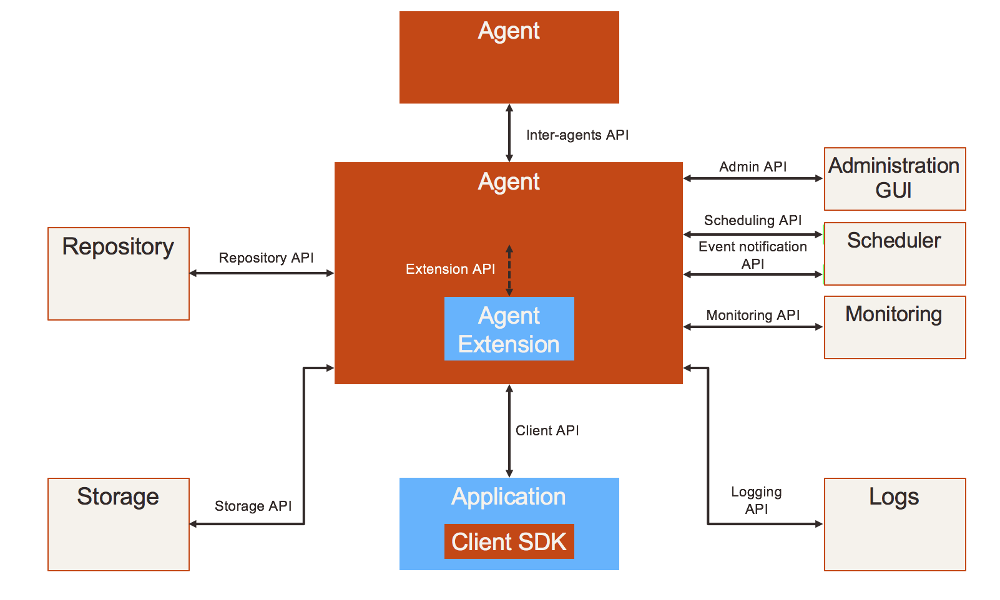

FlowBox
#######

This document represents the whole norm for creating agents compatible with a FlowBox network. The latest published version is on `GitHub <https://github.com/enioka/flowbox-spec/releases>`_.

.. toctree::
   :maxdepth: 2

   norms
   submit

Introduction
************

The purpose of the flowbox protocol is to propose a highly distributed architecture able to meet most demanding 
integration needs of corporate ITs. One can see it as a way to build a fully distributed virtual ESB. It is an 
architecture rather than a product. Because architecture is what matters when you have to integrate pieces together. 

Still this design is not only an abstract vision of how one should try to integrate complex systems in the web era,
it is designed for real life implementations and agile evolutions. The design leverages years of hard lessons 
in enterprise applications integration projects, with or without state of the art integration solutions as EAIs, ESBs or ETLs. 
We feel that these solutions focus too much on development tasks, and not enough on global system architecture. 
And by thinking that they are THE ultimate and universal integration solution and not just one of them, they miss the hardest
point to address which is to scale with (organisation, IT) complexity and time.

The main objectives of this project are :

* to bring a highly consistent integration solution for new highly hybrid information systems, that mix and match 
  on premise and cloud, software packages and custom developments, own services and partners' services,
* to provide a global integration framework that will natively meet most demanding requirements for agility, expressiveness, 
  robustness, security, high availability, scalability, manageability, at little cost for developpers,
* to support all integration schemes : files, messaging and synchronous services, from simple integrations (as native webservice 
  calls or file exchanges) to elaborate orchestrations or complex transforms.
* to make possible for application developpers to use their own development languages to implement these integration tasks 
  with little if any prerequisites to implement these.

To meet these objectives, a few design principles :

* open protocol by design so that any party can provide implementations and enhancements of their own, just as HTTP does,
* extensible protocol, with strong focus on upward compatibility,
* no central point by design, even if some deployment topologies can c hoose to centralize some components,
* capability to manage a set (or subset) of integration flows from a unified user interface,
* no language or technology dependency so that anyone can join the virtual ESB with his own languages and tools, 
  given very limited prerequisites (but the standards of the Internet),
* little interference in actual applicative protocols supported : use SOAP, REST/XML, REST/JSON, simple CSV 
  or whatever choice of applications,
* high flexibility to let applications "code" integration rather than expect magic tools to provide supposedly friendly, 
  code free integration,
* still let place for added value integration providers deliver generic transformers,  visual programming tools 
  if it can help, or even "in the middle" value added services by third parties as archiving, non repudiation proof, publish/subscribe, etc...
* think the whole as open network of service providers and consumers that is by design able to let solutions 
  integrate smoothly with multiples parties : internal applications, cloud based SaaS solutions, suppliers, 
  customers and humans to efficiently collaborate and share information and services,
* therefore think of security as a first rank citizen, not an add on. As a default do not trust more components 
  in the network than you really have to.
* do not reinvent the wheel and reuse whatever clever solutions that already exist. Either as standards, as open source, 
  or even as proprietary integration solutions. The need is for help in making things work together, not for new problems to prevent it.
* especially do not try to change or redefine what an application container is. There a lot of such things, do not 
  force existing applications to tackle with new weird technologies, how clever they may be.
* integration processing code must belong to an application. There should never be "orphan" code that does not belong to anybody. 

The purpose of this specification is to define the basis for this general architecture. It is both :

* an architectural specification, that aims to define components and their interactions to achieve the tasks 
* a protocol that defines how multiple implementations may coexist without need for any shared binaries, 
  nor proprietary software anywhere, especially not in the middle.
* an interface specification to facilitate the integration of applications and promote emergence of added value
  software components easy to embed as "plug ins" or "add ons".

Standard implementations in C# (.Net Core) and Java will be provided separately, as enioka is committed in providing 
such implementations as proof of the concept and support needs of real life customers. More advanced and ambitious 
implementations may take place as this protocol is designed to be neutral and open to contributions.

A few definitions
*****************
* **environment** : any IS development process requires different activities (development, integration, unit tests, Q&A, 
  production, training). One allocates separate so called environments that mimic the future production to support these 
  activities. It is quite usual to allocate at least a development, a Q&A and a prodcution environment for each project.
* **application** : there is no very clear definition of what an application is.   It's main purpose is to "divide and conquer" a monolithic information system and to cut it in quite decoupled
  pieces that can be built, deployed, managed and changed independently from one another. It can be more or less coarse grained.
  Modern front and agile applications tend to be quite fine grained, where back end ones tend to be coarse grained. 
  Most of the time applications are a consistent block of software, with consistency from multiple perspectives : 
  business users, functionalities, data managed, data storage, underlying technologies. 
* **application instance** : an application instance is a full deployment of an application for a given use in a given
  environment. The same application may have multiple instances for different perimeters (as per country, per site,
  per subsidiary). When an application is deployed in an environment, a new instance is allocated as well.
* **flow** : a flow is an integration sequence of processings and information exchanges between two (or more) applications. It does
  describe how these applications communicate with one another. Most of the time a flow links two applications only,
  but in more complex cases a flow may consist in the orchestration of multiple applications communications. A flow is a 
  coordinated sequence of information communication and information processing between applications.
* **flow instance** : a flow instance is a flow actually instanciated between two application instances. Most of the time 
  it should link applications of the same type environments (dev to dev, Q&A to Q&A, prod to prod). But in some cases
  a flow instance may link environments of different types (when one of the application has multiple environments
  to support multiple projects).
* **flow occurence** : a flow occurence happens at each execution of a flow. Each API call for instance is an occurrence of
  the underlying flow. If a flow is processed in a daily batch, then a flow occurrence is created daily.

Main building blocks
********************

Here is an overview of the different blocks : 

Core components
===============

The flowbox protocol defines interactions between a few core components :

* the **application** : as stated in the definitions, we consider integration between applications. The application itself 
  has some role to play in the integration task. The less the better. But in the end, it is (more and more) a primal
  function of an application to integrate to its environment. Every application must consume and provide services and 
  information from/to others.
* the **agent** : each application has an agent (some may say an emissar) that acts as a proxy (for outgoing flows) or 
  a reverse proxy (for incoming flows). The agent is the place where (a part of) the integration processing takes
  place and is the unique touch point of the application with the "outside". Though the design promotes for a quite 
  separate part of the application, the agent can very well be a native part/module/component of the application. In 
  specific cases an agent can be an application in itself when application code is limited to very little. An agent 
  must at least be instanciated for each application instance of each environment, potentially more than once to balance 
  or dedicate workloads to some specific resources.
* the **administration** application(s) : there is a need for a (virtually) centralized administration. Virtually because 
  there may (and should be) multiple administration points in large configurations. There is no need nor benefit for
  everybody to see everything. The only actual need is for a given administrator to be able to manage the scope of
  integration he is in charge of, from a single (and consistent) point. We will call this scope a "floworg" in the folowing
  (waiting for a better name). Administration solutions can be implemented in
  a technology and agents in others, since their integration only relies on the flowbox protocol. The administration 
  application(s) are by design only specialized cases of applications with predefined flows specifications. Any given 
  configuration element can be managed by only one administration application. Any agent belongs to one and only one
  floworg. However it can have flows with agents of other floworgs.
* the **log** sink(s) : this the place that consolidates all logs of all parties. Just as for administration application(s)
  there could be multiple such sinks for large deployments. Still to be defined whether any log can be shipped to only 
  one or multiple log sinks.

Extension components
====================

Core components are the essential ones (and the only strictly mandatory for a given implementation). Others are optional to the
specification, but still make life easier when one expects agent implementations to address large scale problems
and deliver  options to smmoothly fit to various application contexts (languages, application servers, databases, ...).
The very principle of this distributed architecture is to match to the closest the various technology choices of 
applications so that agents can easily fit in their ecosystems. Hence some general architecture is recommended to 
implement agents, to further promote reuse, sharing and concepts interoperability across implementations.

* the **agent repository** : this is where the agent stores its configuration data. This configuration data provides all 
  information an agent needs to perfom its tasks without any need for other configuration. It provides standardized information
  about flows under execution, as well as custom meta data for plug ins and processing steps of flows. This part of the agent 
  can be implemented in many ways, the simplest one being in memory with underlying file storage. 
* the **agent message store** : this storage is the place where the agent can store and retrieve flows processed asynchronously. 
  Multiple implementations of the message store can be provided : it can be based on a regular message queueing engine, 
  on a database, on shared network filesystem, on S3 or on any such shared storage with minimal indexing capability and concurrent
  access control.
* the **agent plug ins** : the agent can (optionnally) host application code. This code tightly interacts with the agent
  core engine, in more or less complex ways. The code can be generic (and load metadata to guide its execution) or fully
  specific to the application. In both cases, the code is considered as appplication code, that is run by the agent on
  application behalf. When the agent blends with the application itself, it represents the part of the application code
  that the standard agent code can interact with. The purpose of the agent plug ins is to extend the core capabilities
  of the minimal agent implementation and provide extensions to meet specific application needs (as transforms, specific
  protocols handling, ...). An agent implementation may have limited or no plug in capability.
* the **agent container** : this is the part of the agent that ensures integration to the container technology that supports
  the agent execution (as an IIS website or a Java application). It is specific to both the language and the container type. 
  A standalone container can be provided where this agent container is a container of its own. But most of the time, the agent 
  container will leverage existing container technologies. The benefit for agent container is to abstract the underlying
  services needed for an agent to properly deliver its features. But an agent may completely 
* The **agent client sdk** : as a convenience (not mandatory), application code has to connect to its agent. In simple cases
  it can be achieved through native http protocol. However, to simplify boilerplate code to interoperate between agent and
  application, the agent client sdk intends to provide applications with a standardized API in their native language.

IT  infrastructure
==================
The flowbox protocol must also integrate to its infrastructure environment. It has a number of touch points that need 
to be addressed in the specification, even if informal.

* network (datacenters, topologies, firewalls and security zones, ...)
* DNS,
* load balancers,
* virtualization and cloud,
* containers  

Development environment
=======================
The flowbox must also smoothly integrate in a regular application development process :

* development & debugging tools : objective is to provide easy to use local development environment, 
  with fast code/test/debug cycle and easy test environment setup. Main issue is to fit in most common
  and recognized development ecosystems to provide nice developer experience with minimal overhead.
* source code management tools : one must be able to store and organize flow configuration information
  and potential plug ins just if they were regular artifacts, possibly stored in various code repositories
* build tools : provide support to build deployment time artifacts in a fully automated process.
* continuous integration tools : 
* testing tools : 

IT management & operations
==========================
The flowbox protocol must also integrate to its IT management environment, for smooth operations, from setup
to day to day operations :

* scheduling :
* monitoring :
* incidents management :  
* operations automation : 
* user provisionning : 
* environment provisionning & management : 
* performance management : 
* configuration & deployment : 

Instances & deployment topologies
*********************************

For a good understanding of the flow specifications it is mandatory to understand the various ways this architecture
may be rolled out. A number of elements in the flowbox protocol are there to support the capability to implement these 
alternate deployment topologies.

Application instances
=====================

A given application can have multiple instances : an application can be instanciated multiple times, both to support 
the various environments needed in projects (development environments, testing environments, production environment) 
and to support multiple uses of the same application code for different perimeters (per subsidiary, per country, 
per business unit, per site, ...).

Integration between applications is in fine establishing flows between application instances. Each flow ever to be deployed
in the flowbox architecture is therefore a link between (at least) two application instances.

Agent instances & tenants
=========================

The notion of agent is intended to be strongly linked to the application lifecycle. So in its most straightforward deployement topology
it is natural to associate at least one agent per application instance. But scalability or availability may require to deploy more
than one agent for a given application instance to properly sustain the workload and the expected service level.

Adversely in some cases, this principle may appear as heavy and constraining. Allocating new technical resources for each application 
module instance for the sole purpose to execute the agent can be burdensome. Therefore agent instances can be arbitrarily mutualized
(as long as this mutualization makes sense and that associated applications are ok to share same binary runtime and computing
resources for their agent). In the following we will use the following vocabulary :

* an **agent instance** represents a deployment of the agent code in a given container, providing its isolation. In some cases, one may choose
  that multiple agent instances actually share their binary code. But it is a matter of technical optimization. We will consider that 
  two agent instances are two logical autonomous engines.
* an **agent tenant** is a virtual slice of an agent instance dedicated to the processing of the flows of a give application instance
  when the agent instance is mutualized to support the flows of multiple application instances. When an agent instance has a
  single tenant, then both notions coincidate. 
* To be noted : the same tenant can be deployed in multiple agent instances. 

Therefore in all communications with agents, one will need to both specify an agent instance (will be the URL to its container) and the
tenant adressed within this agent instance. In the cases where agents are dedicated to one single application instance module.

Protocols
*********

Protocols are technology neutral specifications of standardized integration mechanisms 
defined only in terms of http interactions between agent core and its external environment.

SPIs define means to extend the built in agent model or to implement part of its underlying features.
APIs define language specific bindings (not standardized) provided to applications to interact with agent infrastructure.

General protocol conventions
============================

Objectives
----------

Network & DNS integration considerations
----------------------------------------
* Load balancers
* Firewalls
* DNS & naming agents
* Stateful services
* Infrastructure proxys
* Agent as a proxy

Principles
----------
* HTTP(s) only for the standard
* HTTPS only for interagent communication with client certificates (see security model)
* No prerequisites on application native http capabilities
* Least interference with native application protocols
* No wrapper (still under discussion)

Agent URL structure as seen by applications
-------------------------------------------
https://<hostname>:<port>/<container-specific-agent-prefix>/<agent-id>/<agent-service>/<application-uri>

Where : 

* https is not optional, since https tls certificate client negociation is a an essential part of the security
  model.
* <hostname> is a conventional addressing scheme as defined by the customer/organization. Recommendation is to define 
  an alias to hostname for each application instance (ie defined per application, environment et possibly instanciation
  perimeter). But agnostic for agent infrastructure that will in all cases know the whole access path to each agent 
  in the configuration. When agent is mutualized and deployed as a multitenant container, it will have a generic meaning 
  (as API gateway agent in production).
* <port> should be 443 (default for https) as much as possible. 
* <container-specific-agent-prefix> is any arbitrary path as defined during agent deployment. Recommended to be as 
  standard as possible for each agent technology, container and organization. It does uniquely identify an agent instance.
* <agent-id> is a locally unambiguous agent tenant id within the agent container. If <agent-id> is default or none, then the first 
  (default) agent deployment in this container is used. <agent-id> is an arbitrary name or id used in the agent instance 
  configuration to identify an agent tenant. This is an optional part in the URL of the agent, whose semantics are
  however known by the agent to agent protocol.
* <agent-service> identifies which part of the agent to adress, depending on who is calling for what purpose.
* <application-uri> is dependent on the type of service called. When handling an application flow, either inbound or
  outboud, this uri is closely derived from the initial native uri exposed or consumed by applications.

<agent-service> is the key routing entry point in the agent that will ensure that the request is properly handled. It is
a convenience to ease agent requests routing and to delineate start of application specific url.
It can be one of : 

* AGENT : this endpoint gathers all exchanges between agents
* WS : this endpoint does handle all web services related calls that the application can call.
* MSG : this endpoint does handle all message related calls that the application can call. 
* FILE : this endpoint does handle all file related calls that the application can call.
* APP : this endpoint groups all agent services related to application, to provide configuration and runtime services to the
  participating applications.
  
Question : does it make sense to distinguish WS/MSG/FILE ? what benefits ?

Agent headers
-------------
A number of notions need to be handled out of band of the main payload since payload could (should) be encrypted. Unless 
explicitely entitled to "look" into the payload, agent code should never do more than forward the content as a
black box. Only applications, and their delegates plug ins in the agents can possibly access the payload. Therefore, the
agent must find in headers (possibly optionnally url ??) a number of information required to know what to do with incoming
flow.

The following headers are reserved for this purpose in all communications, some may be set optionnally depending
on communications :

* <FLOWBOX_HEADER_PREFIX>_FROM_ORGANISATION :
* <FLOWBOX_HEADER_PREFIX>_FROM_APPLICATION :
* <FLOWBOX_HEADER_PREFIX>_FROM_APPLICATION_ENVIRONMENT :
* <FLOWBOX_HEADER_PREFIX>_FROM_APPLICATION_INSTANCE :
* <FLOWBOX_HEADER_PREFIX>_FROM_AGENT_INSTANCE :
* <FLOWBOX_HEADER_PREFIX>_FROM_AGENT_TENANT :
* <FLOWBOX_HEADER_PREFIX>_TO_ORGANISATION :
* <FLOWBOX_HEADER_PREFIX>_TO_APPLICATION :
* <FLOWBOX_HEADER_PREFIX>_TO_APPLICATION_ENVIRONMENT :
* <FLOWBOX_HEADER_PREFIX>_TO_APPLICATION_INSTANCE :
* <FLOWBOX_HEADER_PREFIX>_TO_AGENT_INSTANCE :
* <FLOWBOX_HEADER_PREFIX>_TO_AGENT_TENANT :
* <FLOWBOX_HEADER_PREFIX>_FLOW_ID : 
* <FLOWBOX_HEADER_PREFIX>_FLOW_BUSINESS_TRACKING_ID :
* <FLOWBOX_HEADER_PREFIX>_FLOW_TECHNICAL_TRACKING_ID :

Agent configuration
-------------------
The agent is mostly configured remotely after its first deployment. Some agent implementations may provide capability
to upgrade an existing deployment, even possibly deploy agent automatically. This is specified in the administration
protocol (but optional in support). Each agent instance has the following mandatory configuration elements (stored
as the agent sees fit in its technology context) :

* path to certificate of the agent instance (yet to see if there is also a certificate per agent tenant when agent is
  deployed in multi tenant mode - if could be nice to use agent's instance certificate for the default tenant),
* fully qualified url to the administration agent from which the agent will get its configuration,
* flag indicating whether the agent pulls his configuration (default) or if its pushed to the agent by the administration.
  This flag is required for the agent to wait for its configuration upon startup when configuration is pushed
* predefined flow configuration to support administration & log protocol.

All other configuration elements should be derived from administration protocol.

Application to Agent protocol
=============================
This is the standard protocol through which applications and agents call each other.
This covers only standard communications.  More specific ones can be implemented through the agent 
extension SPI, but there is no strong constraint for an agent to implement such extension mechanism.

Initiated by an agent
---------------------
For inbound flows (ie flows coming in the application) :

* Call synchronous service : calls a synchronous service provided by the application. Can be called either 
  in an end to end synchronous call, as well as in message to synchronous bridge (caller performs an 
  asynchronous call, but the provider application exposes only a synchronous interface).
* Submit payload : delivers payload on a file path as specified in configuration.
* Run processing : executes a local or remote processing of the application through the execution of 
  a command line job execution. This processing may either consume the incoming flow as a file or
  as an access to the payload with the agent API. 
* Notify inbound progress : provides feedback on inbound communication events on specified application
  endpoint.

For outbound flows (ie flows coming out of the application), the agent may initiate application processing
when the application itself has no capability to actively start the flows. :

* Call synchronous service : calls a synchronous service provided by the application to collect the outgoing
  payload. This payload can possibly be processed synchronously or asynchronously further.
* Consume payload : consume payload on a file path as specified in configuration. This payload is ei
* Run processing : executes a local or remote processing of the application through the execution of 
  a command line job execution. This processing may produce a file or directly send data to the agent (using SDK).
* Notify outbound progress : provides feedback on outbound communication events to the application (if it 
did register to such notifications).

Initiated by an application
---------------------------
For outbound flows (ie flows coming out of the application) :

* Call synchronous service provided by another application,
* Call synchronous service provided by another application, referencing a payload provided separately as a file
* Send asynchronous message to another application,
* Send asynchronous message to another application, referencing a payload provided separately
* Send asynchronous file to another application,
* Send asynchronous file to another application, referencing a payload provided separately
* Poll processing progress of outbound flow

For inbound flows (ie flows coming in the application, necessarily asynchronous) :

* Get list of ids of received messages or files
* Get metadata of specified id message(s) or files
* Get message payload of specified id message(s)
* Get file payload of specified id file
* Get payload of specified id message(s) on specified file path (accessible by agent)
* Report processing progress of inbound flow (internal integration progress)

Agent to Agent protocol
=======================

Agent to agent protocol is here voluntarily split in two parts, since agent will support both sides of this protocol :
* Communication as initiated by on agent
* Pending service of this communication by another agent.

Heart beat
----------
When two agents are connected by at least one flow, they may need to monitor one another, both to
properly handle pause of agents, and for asynchronous processings between the two agents. This polling
between agents is mutualized between flows to minimize polling between agents. It can be used in
both ways, depending on possible constraints in network security (some agents may not be able to
call others).

To be noted : the heartbeat does support administration flow which is a special case of asynchronous events.

* Ping/poll agent : when an agent polls another one to check for its state and pending asynchronous events
he may be interested in (ie flow between the two agents). 
* Answer ping : service & response of previous.
* Notify agent : when an agent actively notifies other agent of its internal state and pending asynchronous
events to be handled by the other agent.
* Process notifications : service & response of previous.

Synchronous calls relaying
--------------------------
When performing a synchronous call on another application, an agent may need to forward (or
issue) a synchronous call on another agent. Synchronous calls are not multiplexed.

* Call service : this is the request send to another agent
* Answer service : service & response of previous.

Asynchronous calls relaying
---------------------------
* Push payloads : to push flows from an agent message store to another agent message store. This push can handle
messages, or files (possibly only by reference). For efficiency, multiple payloads may be multiplexed. Files
may be broken down. Push is the preferred transport for asynchronous communications.
* Receive payloads : this is the converse of previous seen from the other agent.
* Push notifications : to report flows progress to other agents involved in the communication. Possibly part of
the heartbeat process rather than a dedicated call.
* Process notifications : this is the converse of previous seen from the other agent.
* Pull payloads : to pull payloads from another when security constraints require to pull rather than push.
* Serve payloads : this is the converse of previous seen from the other agent.
* Pull notifications : idem for notifications.
* Answer notifications : this is the converse of previous seen from the other agent.

Administration to Agent protocol
================================

It is a specific use case of standard application to application protocol. The only difference is that 
these messages are not forwarded to the underlying application. Administration is as a default in 
a pull configuration where the administration is strictly passive and waits for agent intiative to
communicate with them. When configured as active with respect to (some) agents, the administration
tool contacts the specified agents.

General configuration model
---------------------------
The administration application(s) may provide extensive and rich modelling capabilities to manage flow configurations.
For this purpose, this administration model may make heavy use of inheritance, multiple tables to manage the configuration.

However the configuration as seen by each agent in the protocol is much simpler and somewhat redundant, because it is
a "compiled" and "serialized" view of the configuration needed by the agent to achieve its tasks. The objective is 
that an agent needs "only" the configuration of a flow to process it, without need to perform join to other reference
data.

The general model of the configuration as seen by an agent instance is as follows (just indicative ad a basis for
discussions) :
  {
   instance : {
      id : <agent-instance>,
      url : <fully-qualified-url-to-agent>,
      state : <agent-global-state>,
      extensions : { <agent-implementation-specific-stuff> }
   },
   flowOrg : <flowOrg>,
   tenants : [
               {
                  tenant : <agent-tenant>,
                  application : <application>,
                  application-module : <module>,
                  application-environment : <environment>,
                  application-instance : <instance>,
                  application-configuration : { <application-specific-stuff> },
                  flows : [
                     {
                        id : <flowid>,
                        way : <in or out>,
                        type : <ws,msg,file>,
                        state : 
                        partner-application : 
                        partner-application-module : 
                        partner-application-instance : 
                        partner-environment :
                        partner-agent-flowOrg :
                        partner-agent-instance :
                        partner-agent-tenant :
                        partner-agent-url :
                        handler : {
                        }
                        extensions : {
                        }
                     } *
                   ]
                 } *
               ]
  }

Agent control
-------------
The heart beat between agents does support the propagation of administration flow controls and notifications
of changes in configuration. These configuration notifications are handled in a special configuration tag in the
heart beat protocol. Typical agent control :

* Start/stop communications globally or per tenant or per flow, or per partner application instance. Agent is still
up and running but selectively closes (as smartly as possible) communications with others.
* Agent restart (?) : this capability would be nice. Still needs access and privileges to act on the container
"from the inside". 
* Agent "soft" reconfiguration (apply configuration, without artefact deployments).
* Agent "hard" reconfiguration, including application artefacts deployment as needed.
* Agent upgrade (here we not only deploy application supplied artefacts, but the agent code itself).
* Agent configuration change notification (requiring a pull).

Configuration
-------------
For the moment the protocol is voluntarily very simple, the administration sending all of the configuration of
an agent as a whole. In longer term a delta update may be  included. The agent may be unavailable temporarily
when processing configuration updates. The agent is not supposed to activate a configuration upon the following
exchanges, it is handled through the agent protocol.
* Push configuration : admin pushes configuration to an agent
* Pull configuration : agent queries admin to get its configuration
* Push configuration artefacts : admin pushed application artefacts referenced by the configuration. Deals with
the deployment of binaries for instance.
* Pull configuration artefacts : same with pull by the agent.

Agent log protocol
==================
The processing of log is another predefined flow, just like flows for administration. Each agent
may need to send its logs to zero, one or multiple log syncs through the agent infrastructure.

Logging control
---------------
Some provision to control the level of logs should be provided as :

* set log level : no log, production, verbose and debug

Logging payload
---------------
The agent asynchronously sends its logs, with the specified level of logs as specified through the log control.
The agent log structure is highly standardized, with (at least) the following 

* date and time of the event
* all flow characteristics : from/to application & application instances, from/to agents instances & tenants,
* flow tracking information (unique tracking id)
* severity of the event (error, warning, info)
* category of the event (performance, technical, applicative or business)
* message of the event

Logs access
-----------
The agent protocol provides access to agent local logs, with limited performance and history.

* list logs with a search criteria (appli, environment, time, ...)
* access detailed logs contents with a search criteria

Central logs access
-------------------
The log sinks may provide central API to access the logs through the agent. These capabilities are to
be exposed by the log sink agent.

* list logs with a search criteria (appli, environment, time, ...)
* access detailed logs contents with a search criteria

Agent monitoring protocol
=========================

The agent must provide a standard http monitoring capability from an outside component
* Exposed health check as a service

The agent must provide a standard http based active monitoring capability
* Report health to external URL

Agent scheduling protocol
=========================
Extension of basic scheduling protocol can be provided via the agent scheduling SPI.
Built in basic scheduling protocol should be provided.

APIs provided to the scheduler
------------------------------
  
Provided as HTTP verbs, can be wrapped in command line tools for easier integration:

* Execute flow
* Poll flow(s) state

Callbacks to the scheduler
--------------------------

Command line interface is the built in way to integrate to a scheduler. The following
callbacks are defined : 

* Report flow progress through command line
* Notify event through command line

Security model
**************
A general model for the agent security should be designed. Just a few questions here :
 
* agent communicate between one another only through a trusted communications channel based on per agent (instance 
or tenant) client TLS certificates,
* agent code never accesses the payload but as an opaque data. Only through application explicitely provided plug ins can the agent
access and modify the payload. Generic plug ins can be used, but on behalf of applications for flows.
* applications handling critical flows are strongly 
* agent provides a secure way to handle (and manage) all credentials, both built in (agent own certificates) and application
delegated (as access account credentials to application resources, or private encryption keys).
* agent does execute only with application level privileges.

Indicative class diagram of an agent
************************************

Yet to be done..

APIs
****

Agent client API
================

Wrappers to the application to agent protocol in native API of the
application language.

Agent Extension API
===================
This API is used by components hosted by the agent in charge of
implementing specific features.

These features can be generic enough to be part of a standard
distribution, or specific to an application.

API exposing services provided by the agent
-------------------------------------------
* Get configuration applicable to the current context
* Register service
* Open input stream
* Open output stream
* Exit meta-data
* Log

API implemented by the extensions
---------------------------------
* Filter available endpoints (routing extension)
* Run flow

SPIs
****

Repository SPI
==============
The agent code should access the repository in a standardized way. The repository API 
provides configuration information in read only mode. Some agent information still can be 
stateful and persistent so that upon restart, the state is not lost. First guess on
the SPI :

* get agent instance configuration
* set agent instance configuration
* get agent tenant configuration
* set agent tenant configuration
* get flow configuration
* set flow configuration
* get agent instance state
* set agent instance state
* get agent tenant state
* set agent tenant state
* get flow state
* set flow state
* save state

The repository SPI should be implemented in different implementations :
* initial implementation should be file based, with json inside, one fragment per configuration piece held in memory by the agent
* 

Message store SPI
=================
The agent must store the payloads for the asynchronous processing. The asynchronous processing
is mandatory to support the administration protocol. Still, a naive implementation can be done
if the target agent is not supposed to support a significant asynchronous workload.

The message store provides storage for messages and files, and handling of their meta data. Message 
store is organized per agent tenant.

* provision/unprovision flow storage
* store message (payload + meta data) 
* store file  (payload + meta data) 
* store file payload as (external) file
* store file payload as stream
* get list of messages of state X
* get message/file metadata
* get message payload
* get file payload as (external) file
* get file payload as stream

Multiple implementations of this message store are likely :

* Flat file implementation,
* Relational database (generic) implementation,
* MOM implementation (using standard MOM APIs),

Scheduler SPI
=============

The agent infrastructure should smmothly integrate with production schedulers. Beyond built in 
scheduler protocol, the agent may provide means to interface more closely with schedulers.

Log SPI
=======

The Log SPI is the standard way for the agent to interact with logs

* log a new entry in logs
* list logs for a search criteria
* access to logs detailed contents for a search criteria

This SPI should be based on standard platform logging standards (as log4J or equivalent).

Notification SPI
================

This does provide ways for each agent to notify external components of events
that happen within the agent. Beyond native notifications to applications and
scheduler capability to notify monitoring tools or mails or any end user.

