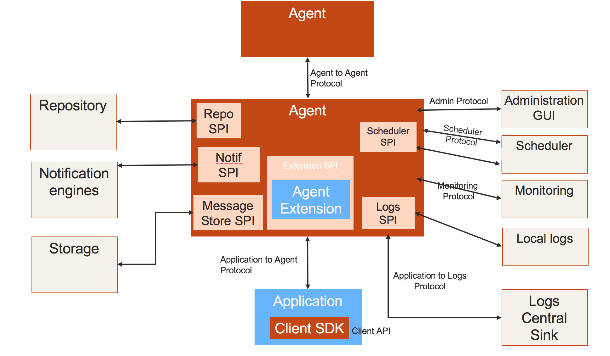

FlowBox
##########################

This document represents the whole norm for creating agents compatible with a FlowBox network. The latest published version is on `GitHub <https://github.com/enioka/flowbox-spec/releases>`_.

.. toctree::
   :maxdepth: 2

   norms
   submit

APIs
****

Client API
==========
This is the API through which applications and agents call each other.

Initiated by an agent
---------------------
* Call synchronous service
* Submit Payload
* Notify  payload submission
* Run processing
* Report processing progress

Initiated by an application
---------------------------
* Call synchronous service provided by another application,
* Call synchronous service provided by another application, referencing a payload provided separately
* Poll processing progress
* Get payload

Agent Extension API
===================
This API is used by components hosted by the agent in charge of
implementing specific features.

These features can be generic enough to be part of a standard
distribution, or specific to an application.

API exposing services provided by the agent
-------------------------------------------
* Get configuration applicable to the current context
* Register service
* Open input stream
* Open output stream
* Exit meta-data
* Log

API implemented by the extensions
---------------------------------
* Filter available endpoints (routing extension)
* Run

Inter agents API
================

Repository API
==============

Scheduler API
=============

Log API
=======

Storage API
===========

Notification API
================

Repository API
==============

